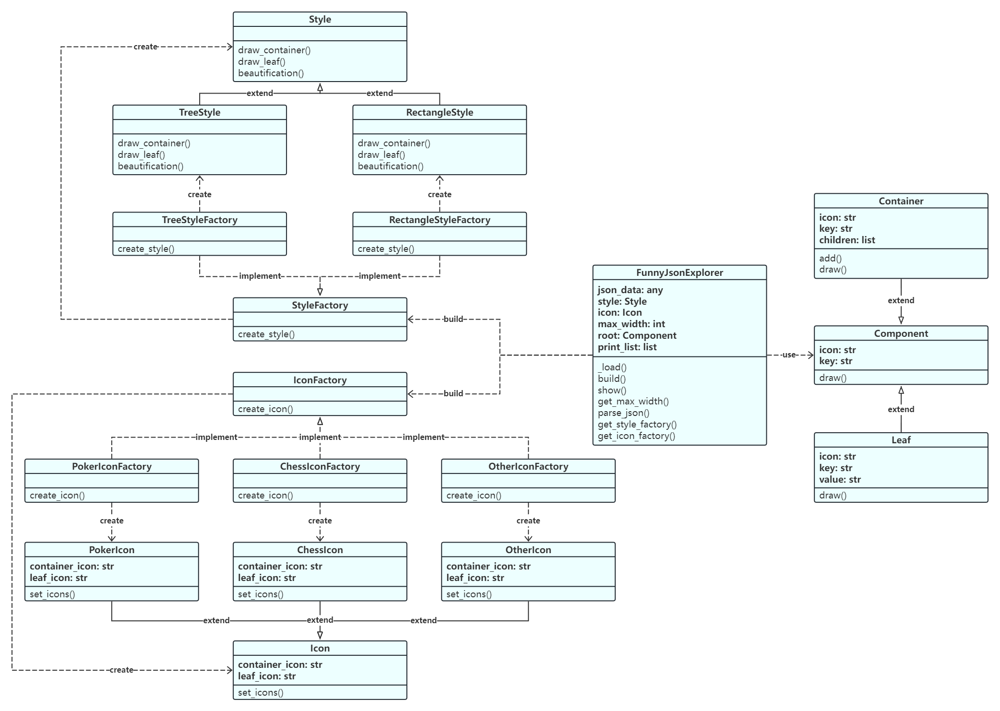
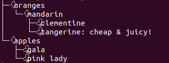
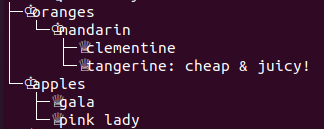
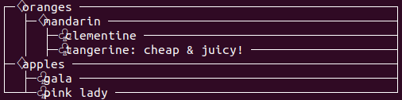
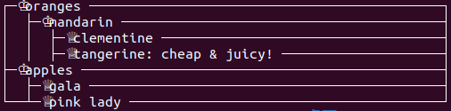
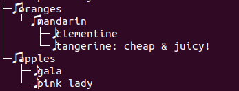

# Funny_JSON_Explorer

Command-line widget for JSON file visualization

Github代码仓库：[https://github.com/AdamLeung16/Funny_JSON_Explorer](https://github.com/AdamLeung16/Funny_JSON_Explorer)

### 一、设计文档

#### 1.1 类图



#### 1.2 说明

##### 1.2.1 工厂方法&抽象工厂

style和icon的实现都使用了工厂方法和抽象工厂的结合。

对于style，定义一个抽象工厂接口StyleFactory，据此创建工厂TreeStyleFactory和RectangleStyleFactory，分别调用基于Style基类实现的风格TreeStyle和RectangleStyle，使用工厂方法直接实现对应风格产品的绘制。

对于icon，定义一个抽象工厂接口IconFactory，据此创建工厂PokerIconFactory、ChessIconFactory和OtherIconFactory，分别调用基于Icon基类实现的图标族PokerIcon、ChessIcon和OtherIcon，使用工厂方法直接实现对应图标族产品的设定。

**StyleFactory类**

* 功能：抽象工厂接口，用于创建风格工厂
* 成员方法：
  * create_style()：创建风格

**Style类**

* 功能：抽象基类，用于风格绘制
* 成员方法：
  * draw_container()：绘制中间节点
  * draw_leaf()：绘制叶节点
  * beautification()：微调美化

**IconFactory类**

* 功能：抽象工厂接口，用于创建图标族工厂
* 成员方法：
  * create_icon()：创建图标族

**Icon类**

* 功能：抽象基类，用于图标族设置
* 成员变量：
  * container_icon：中间节点图标
  * leaf_icon：叶节点图标
* 成员方法：
  * set_icons()：设置图标族

##### 1.2.2 建造者模式

FunnyJsonExplorer类使用了建造者模式，将构建指定风格、指定图标族的json数据可视化小工具这一复杂对象拆分成不同的构建步骤，并在build()和show()方法中逐步实现——事先加载json文件数据并获取指定style、指定icon，计算获取可视化最大宽度，解析json数据，绘制节点，最后美化微调，输出到终端。

**FunnyJsonExplorer类**

* 功能：解析json文件并在终端绘制成指定风格、图标族的可视化结构
* 成员变量：
  * json_data：json文件数据
  * style：指定风格
  * icon：指定图标族
  * max_width：最大宽度，用于对齐
  * root：json树结构根节点
  * print_list：处理后的可视化输出列表
* 成员方法：
  * _load()：从文件加载json数据
  * build()：解析json数据并根据指定style和icon绘制，构建可视化输出列表
  * show()：将可视化输出列表绘制到终端
  * get_max_width()：计算获取可视化最大宽度
  * parse_json()：解析json数据为树结构
  * get_style_factory()：获取风格工厂
  * get_icon_factory()：获取图标族工厂

##### 1.2.3 组合模式

Component类作为基类，Container类和Leaf类继承基类，此处使用了组合模式，用于解析json数据生成树状结构，其中中间节点使用Container类，叶子节点使用Leaf类。

**Component类**

* 功能：抽象基类，表示json树结构的节点
* 成员变量：
  * icon：节点图标
  * key：节点属性
* 成员方法：
  * draw()：绘制节点

**Container类**

* 功能：继承类，表示json树结构的中间节点
* 成员变量：
  * icon：节点图标
  * key：节点属性
  * children：子节点列表
* 成员方法：
  * add()：添加子节点
  * draw()：绘制节点

**Leaf类**

* 功能：继承类，表示json树结构的中间节点
* 成员变量：
  * icon：节点图标
  * key：节点属性
  * value：节点值
* 成员方法：
  * draw()：绘制节点

### 二、运行截图

修改环境变量目录为当前src目录所在路径，运行测试shell脚本run.sh：

```shell
#!/bin/bash
export PATH="$PATH:/home/adamleung/桌面/softwareProject/Funny_JSON_Explorer/src"
source ~/.bashrc
fje -f test/test.json -s tree -i poker
fje -f test/test.json -s tree -i chess
fje -f test/test.json -s rectangle -i poker
fje -f test/test.json -s rectangle -i chess
```

| style\icon          | poker                                          | chess                                          |
| ------------------- | ---------------------------------------------- | ---------------------------------------------- |
| **tree**      |  |  |
| **rectangle** |  |  |

### 三、扩展与维护

#### 3.1 如何添加新的风格？

在style.py中添加新的风格工厂，调用新的风格类，并在Style类下继承实现新的风格类和对应的类方法。同时还要在FunnyJsonExplorer类的get_style_factory()方法中增加对命令行传入的style参数的判断语句，使其调用新的风格工厂。例如，新的风格为"graph"，则对应添加风格的办法如下：

```python
# style.py

class GraphStyleFactory(StyleFactory):
    def create_style(self) -> 'Style':
        return GraphStyle()

class GraphStyle(Style):
    def draw_container(self, icon: str, key: str, prefix: str, max_width: int, is_last: bool) -> Union[list,str]:
        ...
    def draw_leaf(self, icon: str, key: str, value: str, prefix: str, max_width: int, is_last: bool) -> Union[list,str]:
        ...
    def beautification(self, print_list: list) -> list:
        ...
```

```python
# fje

class FunnyJsonExplorer:
    def get_style_factory(self, style:str):
        ...
        elif style == "graph":
            return GraphStyleFactory()
        ...
```

#### 3.2 如何添加新的图标族？

fje命令中有可选参数"-c"("--config")，可以传入自定义图标族json配置文件，在配置文件中添加新的图标族，并在设置图标族参数时直接输入自定义新图标族名称，即可完成添加。自定义图标族json配置文件格式和使用方法如下：

```json
// config/icon.json
{
  "weather": {                   
    "container_icon": "☼",       
    "leaf_icon": "☁"                                
  },
  "music": {                   
    "container_icon": "♫",       
    "leaf_icon": "♪"                                
  },
  "money": {                   
    "container_icon": "￥",       
    "leaf_icon": "$"                                
  },
  "arrow": {                   
    "container_icon": "⇉",       
    "leaf_icon": "➝"                                
  },
  "heart": {                   
    "container_icon": "❤",       
    "leaf_icon": "♡"                                
  }
}
```

```shell
# run.sh
...
fje -f test/test.json -s tree -i music -c config/icon.json
```



#### 3.3 其他

Funny_JSON_Explorer目前只实现了dict结构类型的解析与可视化，未扩展list结构类型。复杂的json文件测试样例可使用test/district.json。
